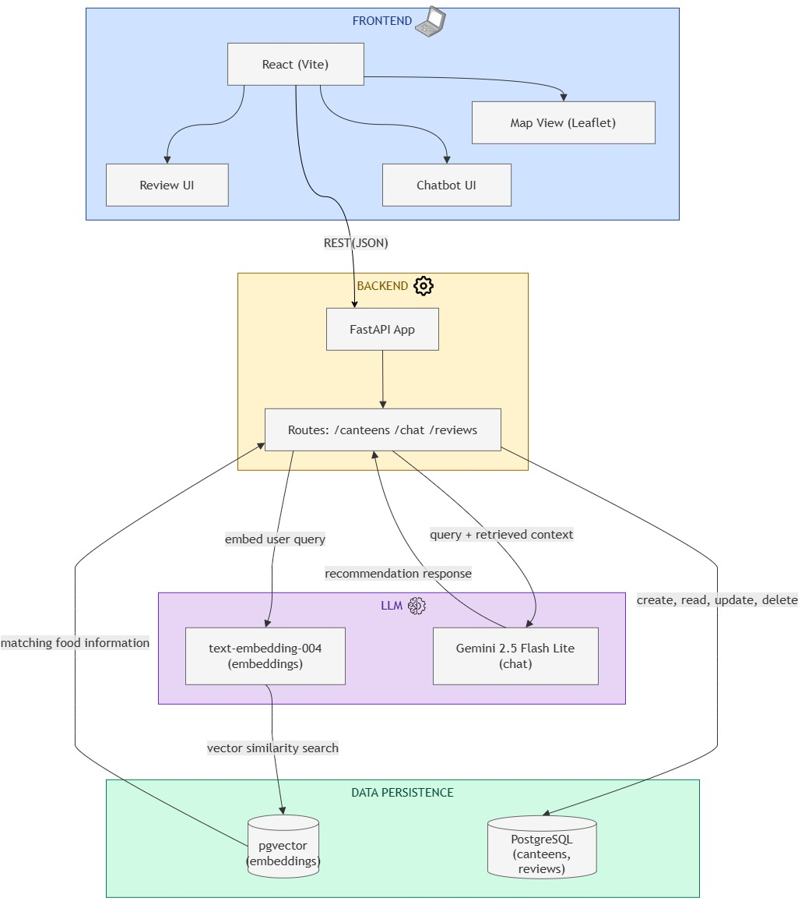

# dip-grp5

## Folder structure

```text
dip-grp5/
├── README.md
├── chatbot.md                          # Chatbot RAG vector-search design notes
├── .gitignore
├── diagrams/
│   ├── dip_architecture_220826.jpg     # Software architecture overview
│   └── rag_chabot.jpg                  # Chatbot RAG flow
├── docs/
│   ├── DIP AI chatbot questions.xlsx   # Curated chatbot questions workbook
│   ├── DIP Chatbot Schema.xlsx         # Chatbot schema workbook
│   ├── Still NEED.txt
│   ├── TODO.md
│   ├── week-3.md
│   └── What Baihao Did wk 3.md
│
└── apps/
    ├── api/                            # FastAPI backend
        ├── app/
        │   ├── main.py                 # App entrypoint + router registration
        │   ├── api/
        │   │   ├── dependencies.py     # Dev auth + DB session dependencies
        │   │   └── routes/
        │   │       ├── reviews.py
        │   │       └── vendors.py
        │   ├── core/
        │   │   ├── config.py           # Pydantic settings (env vars)
        │   │   └── security.py         # Argon2 password hashing
        │   ├── db/
        │   │   ├── base.py             # Shared declarative Base + naming convention
        │   │   ├── vector_base.py      # Separate Base for pgvector tables
        │   │   ├── chatbot_question_data.py  # Curated 59 question rows
        │   │   ├── seed.py             # Repeatable dev seed
        │   │   └── session.py          # Engine + session factory
        │   ├── models/                 # SQLAlchemy ORM (database tables)
        │   │   ├── chatbot_prompt.py
        │   │   ├── knowledge.py        # knowledge_chunks (vector RAG)
        │   │   ├── review.py
        │   │   ├── user.py
        │   │   └── vendor.py
        │   └── schemas/                # Pydantic API request/response DTOs
        │       ├── review.py
        │       └── vendor.py
        ├── alembic/                    # Database migrations
        │   ├── env.py
        │   ├── script.py.mako
        │   └── versions/
        │       ├── 66ba667f797c_create_community_review_schema.py
        │       ├── a8f1c2d3e4b5_add_user_vendor_and_review_updates.py
        │       ├── d9e7f6a5b4c3_make_email_case_insensitively_unique.py
        │       ├── e2c4b6a8d0f1_preserve_email_and_add_canonical_identity.py
        │       ├── f4a6b8c0d2e3_create_chatbot_prompts.py
        │       ├── g5b7c9d1e3f4_store_chatbot_questions.py
        │       └── 176565c7b04e_create_knowledge_chunks.py
        ├── docker/
        │   └── init/
        │       └── 01-enable-vector.sql # Enables the pgvector extension
        ├── tests/
        │   ├── conftest.py
        │   ├── test_backend_todo_updates.py
        │   ├── test_chatbot_prompt_model.py
        │   └── test_vendor_image_api.py
        ├── alembic.ini
        ├── compose.yaml                # Local Postgres (pgvector) container
        ├── manual_wk3.md
        ├── requirements.txt
        ├── .env.example
        └── .venv/                      # Gitignored local virtual environment
    │
    └── web/                            # Vite + React (TS) SPA frontend (sample)
        ├── index.html
        ├── package.json                # App dependencies + ESLint/Prettier callers
        ├── eslint.config.js            # App-specific ESLint config
        ├── tsconfig.json
        ├── tsconfig.node.json
        ├── vite.config.ts              # Dev proxy settings
        ├── public/
        │   └── favicon.svg
        └── src/
            ├── main.tsx
            ├── App.tsx
            ├── App.css
            ├── index.css
            ├── vite-env.d.ts
            ├── components/             # Shared / atomic UI elements (Buttons, Modals)
            ├── features/               # Domain-driven feature modules
            │   ├── reviews/            # Review UI, hooks, and sub-components
            │   └── vendors/            # Vendor UI, hooks, and sub-components
            ├── lib/                    # Axios/Fetch API client instances
            ├── pages/                  # Router page view components
            └── types/                  # Frontend TypeScript interfaces
```

## Architecture



## Project documentation

- [Backend setup and API manual](Manual.md)
- [Community review database design](docs/community-review-database-design.md)
- [Community review database ERD](docs/community-review-erd.svg)
- [Database tables reference](docs/tables/README.md)

## Local backend environment

Python 3.12 and Docker Desktop are used for local backend development.

### First-time setup

```powershell
Set-Location apps\api
python -m venv .venv
.\.venv\Scripts\Activate.ps1
.\.venv\Scripts\python.exe -m pip install -r requirements.txt
Copy-Item .env.example .env
```

Change the local-only database password in `.env`, then start PostgreSQL with
the pgvector extension:

```powershell
docker compose up -d
docker compose ps
```

Create or update the database tables, then seed the local placeholder data:

```powershell
.\.venv\Scripts\python.exe -m alembic upgrade head
.\.venv\Scripts\python.exe -m app.db.seed
```

The repeatable seed command creates or confirms these local placeholders:

| Type | Display name / email | Password/role |
| --- | --- | --- |
| Administrator | `Administrator` / `admin@local.invalid` | password `admin`, role `admin` |
| Normal user | `Test User` / `test-user@local.invalid` | password `test`, role `user` |
| Food stall | `Demo Vendor 1` | `Demo Canteen` |
| Food stall | `Demo Vendor 2` | `Demo Canteen` |

Passwords are stored as Argon2 hashes. Running the seed command again does not
create duplicate placeholders. Its output shows the generated IDs.
Email addresses are trimmed and preserved for display and delivery. A separate
lowercase canonical value enforces uniqueness without regard to case. Display
names are not unique and may be shared by multiple users.
The optional `affiliation` field is retained as part of the user profile and is
included with the public review-author summary.

### Temporary local authentication

Until the team integrates the real login system, a protected FastAPI route can
use the placeholder dependency:

```python
from app.api.dependencies import CurrentUser


def protected_route(user: CurrentUser):
    return {"user_id": user.id}
```

With `DEV_AUTH_ENABLED=true` in the local `.env`, the frontend or an API client
can choose a seeded user by sending its generated ID:

```text
X-Dev-User-Id: <seeded user ID>
```

This header is a development shortcut, not secure authentication. The example
environment keeps it disabled. Replace it with the team's real session or token
authentication and keep `DEV_AUTH_ENABLED=false` in every shared or deployed
environment.

## Run the API

Start FastAPI from `apps/api`:

```powershell
.\.venv\Scripts\python.exe -m fastapi dev app\main.py
```

Open <http://127.0.0.1:8000/docs> to use the interactive API page.

### Create a review

`POST /reviews` accepts a food-stall ID, a required rating from 1.0 to 5.0 in
0.5-star steps, and an optional comment. Use the IDs printed by the seed script:

```powershell
$body = @{
    vendor_id = 2
    rating = 1
    comment = ""
} | ConvertTo-Json

Invoke-RestMethod `
    -Method Post `
    -Uri http://127.0.0.1:8000/reviews `
    -Headers @{ "X-Dev-User-Id" = "1" } `
    -ContentType "application/json" `
    -Body $body
```

The API takes `user_id` from the authenticated user header; it does not accept
`user_id` in the request body. An omitted or whitespace-only comment is stored
as `NULL`, so rating-only reviews are supported.

### Read reviews

Reading community reviews is public and does not require the temporary login
header:

```text
GET /reviews
GET /reviews/{review_id}
```

The list endpoint returns the newest reviews first. It supports:

| Query parameter | Default | Purpose |
| --- | ---: | --- |
| `vendor_id` | none | Return reviews for one food stall |
| `limit` | `20` | Number of reviews to return; maximum `100` |
| `offset` | `0` | Number of reviews to skip for pagination |

Example:

```text
http://127.0.0.1:8000/reviews?vendor_id=3&limit=20&offset=0
```

Each returned review includes its user, vendor, rating, optional comment,
creation time, optional `updated_at`, `is_edited`, and image metadata. Public
user data exposes `display_name`, not the email address. The list response also
includes `total`, `limit`, and `offset` so the frontend can build pagination.

### Edit a review

`PATCH /reviews/{review_id}` allows the review author to change the rating,
comment, or both. The API rejects edits by other users. A successful edit sets
`updated_at` and returns `is_edited: true`, which the frontend can render as
`(edited)`.

```powershell
$body = @{
    rating = 4.5
    comment = "Updated review"
} | ConvertTo-Json

Invoke-RestMethod `
    -Method Patch `
    -Uri http://127.0.0.1:8000/reviews/1 `
    -Headers @{ "X-Dev-User-Id" = "1" } `
    -ContentType "application/json" `
    -Body $body
```

### Delete a review

`DELETE /reviews/{review_id}` requires the temporary user header. A normal user
may delete only their own review; an administrator may delete any review.

```powershell
Invoke-RestMethod `
    -Method Delete `
    -Uri http://127.0.0.1:8000/reviews/1 `
    -Headers @{ "X-Dev-User-Id" = "4" }
```

A successful deletion returns HTTP `204` with an empty body. The API returns
`403` when another normal user owns the review and `404` when the review does
not exist. Related `review_images` database records are removed automatically.
Deleting external image files will be added when the storage provider is
selected.

### List food stalls

`GET /vendors` is public and gives the frontend the available food stalls and
their IDs:

```text
http://127.0.0.1:8000/vendors
```

It supports:

| Query parameter | Default | Purpose |
| --- | ---: | --- |
| `q` | none | Search name, location, or category |
| `limit` | `100` | Number of food stalls to return; maximum `100` |
| `offset` | `0` | Number of food stalls to skip for pagination |

Vendor images are stored in the separate `vendor_images` table. Each item
contains an ordered `images` list and retains a derived `image_url` containing
the first image for frontend compatibility. Items also contain `updated_at`,
`review_count`, and `average_rating`. The average is calculated from current
reviews and is `null` when a food stall has no reviews.

Vendor image metadata can be managed through these endpoints:

```text
GET    /vendors/{vendor_id}/images
POST   /vendors/{vendor_id}/images
PATCH  /vendors/{vendor_id}/images/{image_id}
DELETE /vendors/{vendor_id}/images/{image_id}
```

Reading is public. Creating, editing, reordering, and deleting images require an
administrator through the temporary development authentication dependency.
`POST` accepts `image_url` and an optional positive `display_order`; when the
order is omitted, the API appends the image. The first ordered image is the
vendor thumbnail. This API stores image URLs and metadata only—it does not
upload binary image files.

### Chatbot prompt storage

The `chatbot_prompts` table first stores the curated example questions used to
design the chatbot. Each question has a stable key, its original text, a concise
question scope, a search type (`SQL`, `Vector`, or `SQL + Vector`), source-file
metadata, an `is_active` switch, and timestamps. `prompt_template` remains
nullable until prompt authoring begins.

The repeatable development seed imports 59 unique questions from
`DIP AI chatbot questions.xlsx` and `DIP Chatbot Schema.xlsx`. One exact question
appears in both files and is stored once with both sources. Prompt lookup APIs
and the LLM connection are intentionally left for the next chatbot step.

Run the schema and database integration tests:

```powershell
.\.venv\Scripts\python.exe -m pytest -q
```

Stop the local services without deleting database data:

```powershell
docker compose stop
```

Use `docker compose down` to remove the container and network. The named
database volume is retained unless `--volumes` is explicitly supplied.
