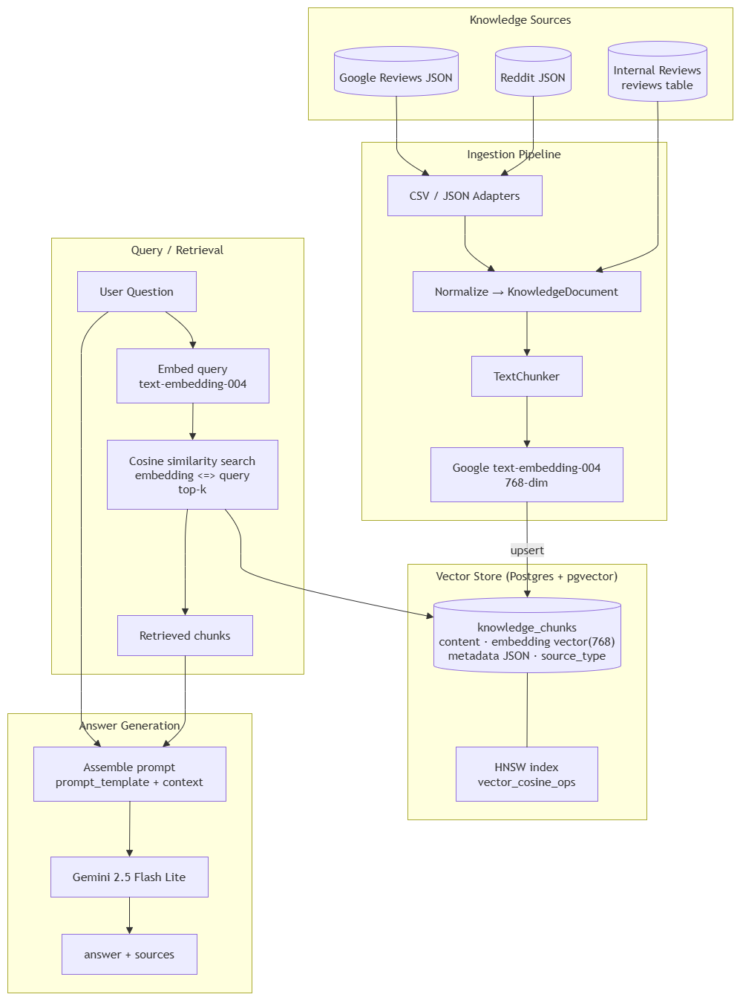

# NTU Foodie Hub — Chatbot RAG Vector Search

Design and implementation notes for the RAG chatbot's vector-search feature.
This complements the API-level docs in `README.md`.

## Overview

The chatbot answers context-aware questions about food stalls (vendors) by
retrieving relevant chunks from a vector knowledge base and passing them to an
LLM along with the user's question.

```
user question ─▶ embed (text-embedding-004, 768-dim)
                    │
                    ▼
        pgvector cosine search over knowledge_chunks
        (optional SQL filters for SQL+Vector intents)
                    │
                    ▼
        retrieved chunks ─▶ prompt_template + {context}
                    │
                    ▼
        Gemini 2.5 Flash Lite ─▶ answer + sources
```

The knowledge base is **unified**: internal reviews and external data
(Reddit, Google Reviews) are stored in one table, `knowledge_chunks`, with a
`source_type` discriminator.

## Architecture



## Technology choices

| Concern | Choice |
|---|---|
| Vector store | PostgreSQL 17 + `pgvector` (HNSW index, cosine distance) |
| Embedding model | Google `text-embedding-004` (768-dim) |
| Answer generation | Gemini 2.5 Flash Lite |
| LLM SDK | `google-genai` (single SDK for embeddings + chat) |
| Metadata column | generic `JSON` (works on SQLite and Postgres) |
| Test isolation | vector tables kept off the shared `Base` so SQLite tests stay green |

## Configuration

New settings in `app/core/config.py` (all overridable via environment, see
`.env.example`):

| Setting | Default | Purpose |
|---|---|---|
| `gemini_api_key` | `None` | Gemini API key (Google AI Studio) |
| `embedding_model` | `text-embedding-004` | Embedding model id |
| `embedding_dimensions` | `768` | Vector dimensionality (fixed per model) |
| `embedding_batch_size` | `100` | Chunks embedded per API call |
| `chat_model` | `gemini-2.5-flash-lite` | Chat model id (exact id configurable) |
| `vector_top_k` | `8` | Chunks retrieved per query |

Environment additions in `apps/api/.env.example`:

```
GEMINI_API_KEY=
EMBEDDING_MODEL=text-embedding-004
EMBEDDING_DIMENSIONS=768
EMBEDDING_BATCH_SIZE=100
CHAT_MODEL=gemini-2.5-flash-lite
VECTOR_TOP_K=8
```

Dependency added to `apps/api/requirements.txt`: `google-genai==1.31.0`.

## Knowledge base schema

The `vector` column type is Postgres-only, so vector-backed tables live on a
separate declarative base, `VectorBase`, rather than the shared application
`Base`. This keeps `Base.metadata.create_all` in the SQLite test fixtures from
ever trying to compile `VECTOR(768)`.

### `app/db/vector_base.py`

```python
class VectorBase(DeclarativeBase):
    metadata = MetaData(naming_convention=NAMING_CONVENTION)
```

### `app/models/knowledge.py` — `KnowledgeChunk`

| Column | Type | Notes |
|---|---|---|
| `id` | `Integer` identity PK | |
| `source_type` | `varchar(32)` | `internal_review` \| `reddit` \| `google_review` (CHECK) |
| `source_id` | `varchar(255)` nullable | external id, or `str(review.id)` for internal |
| `vendor_id` | `int` nullable FK → `vendors.id` | `ON DELETE SET NULL` |
| `content` | `text` | the retrievable chunk text (CHECK non-blank) |
| `embedding` | `vector(768)` | `pgvector.sqlalchemy.Vector` |
| `metadata` | `json` nullable | `{rating, author, url, posted_at, subreddit, …}` |
| `created_at` | `timestamptz` | server defaults, `onupdate` |
| `updated_at` | `timestamptz` | server defaults, `onupdate` 

> Note: the SQLAlchemy mapped attribute is `metadata_json` because the name
> `metadata` is reserved by the Declarative API. The database column itself is
> named `metadata` via `mapped_column("metadata", JSON, ...)`.

### Migration

`alembic/versions/h1e2f3a4b5c6_create_knowledge_chunks.py`
(`down_revision = g5b7c9d1e3f4`)

- `CREATE TABLE knowledge_chunks` with the columns above, FKs, and CHECK
  constraints.
- HNSW index via raw SQL (pgvector 0.5.0 has no `HNSWVectorIndex` helper):

```sql
CREATE INDEX ix_knowledge_chunks_embedding_hnsw
ON knowledge_chunks USING hnsw (embedding vector_cosine_ops)
WITH (m = 16, ef_construction = 64);
```

`alembic/env.py` registers both metadata objects so autogenerate sees all
tables:

```python
target_metadata = [Base.metadata, VectorBase.metadata]
```

## Intent routing (planned)

The `chatbot_prompts` table records a `search_type` for each curated question:

- `SQL` — structured filters over `vendors` / `reviews` (dietary, cuisine,
  budget, hours, location). Skips the vector path.
- `Vector` — pure embedding similarity search.
- `SQL + Vector` — apply structured filters first, then cosine-rank within.

The retrieval layer exposes optional `filters` so `SQL + Vector` can be wired
to intent classification later.

## Services (next steps)

Planned modules under `app/services/`:

- `embedding.py` — `Embedder` protocol + `GoogleEmbedder.embed(texts)` (batched
  `embed_content`).
- `retrieval.py` — `KnowledgeStore` protocol (`upsert`, `delete`, `search`);
  `PgvectorKnowledgeStore` (real, `<=>` cosine) + `FakeKnowledgeStore`
  (in-memory, brute-force cosine for tests).
- `chat.py` — `ChatService.generate(system_prompt, question, context)` via Gemini.
- `chunking.py` — `TextChunker` (short text whole; long text sentence-split
  with overlap).
- `ingest.py` — `Ingestor` protocol with `CsvIngestor`, `GoogleReviewsJsonIngestor`,
  `RedditJsonIngestor`, normalized via a `KnowledgeDocument` dataclass.
- `app/db/reindex.py` — CLI (mirrors `seed.py`): internal backfill from
  `reviews`, external import from files → chunk → embed → upsert.

A new `POST /chat` route will return `{ answer, sources: [...] }`, with the
final prompt built from `ChatbotPrompt.prompt_template` extended to use
`{user_question}` and `{context}` (a default system prompt when the template is
NULL, as all seeded rows are today).

## Testing strategy

- **Unit tests (SQLite, no vector DB):** chunking, adapter normalization,
  prompt assembly, route behavior — via `FakeEmbedder` / `FakeKnowledgeStore`.
- **Vector integration tests (Postgres):** a `@pytest.mark.vector` marker gated
  on `TEST_DATABASE_URL`, exercising `PgvectorKnowledgeStore` + HNSW search.
  Excluded by default so `pytest -q` stays green.